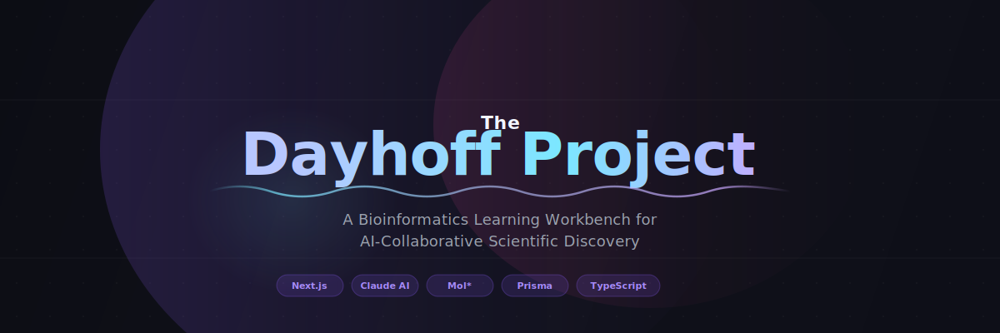
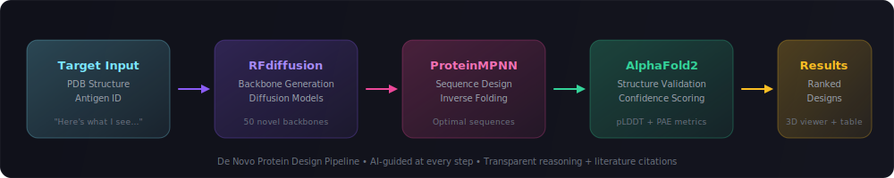

<p align="center">
  
</p>

<p align="center">
  <strong>AI-collaborative drug design that teaches you the science while you do the science.</strong>
</p>

<p align="center">
  <a href="#getting-started"></a>
  <a href="#features"></a>
  <a href="#the-dayhoff-learning-model"></a>
</p>

<p align="center">
  
  
  
  
  
  
</p>

---

## The Problem

Bench scientists — the people physically running experiments in labs — face a persistent bottleneck: **computational biology**. To design antibody candidates, analyze structural data, or optimize experiments, they must wait for computational biologists (days to weeks), coordinate across fragmented tools, and trust black-box AI outputs they can't interrogate.

Current AI tools optimize for **output** but not for **understanding**. A scientist who uses a black-box tool to generate 100 antibody candidates hasn't learned *why* those candidates were ranked that way, what trade-offs were made, or how to think about the design space differently next time.

**Dayhoff fills this gap** — transforming AI-assisted drug design from task completion into skill development.

---

## What is Dayhoff?

Named after [Margaret Dayhoff](https://en.wikipedia.org/wiki/Margaret_Oakley_Dayhoff), the mother of bioinformatics, **The Dayhoff Project** is a web-based workbench where a bench scientist goes from **target antigen structure → novel protein candidates** through an AI-collaborative workflow. No code. No waiting for computational biology support.

Every AI recommendation comes with:
- **Transparent reasoning** — not just answers, but *why*
- **Literature citations** with DOI links
- **Confidence scores** — where the AI is certain and where it's not
- **Explicit trade-offs** — what you gain and what you give up
- **Alternative approaches** — so you learn to think, not just click

> *"The goal is not to have AI do the science for us. The goal is to have AI make us better scientists."*
>
> — The Dayhoff Principle

---

## Core Workflow

<p align="center">
  
</p>

---

## Features

### Experiment Design & Execution

| Feature | Description |
|---------|-------------|
| **Interactive 3D Viewer** | Mol*-powered molecular visualization with residue selection, hotspot annotation, and drag-to-resize |
| **Workflow Builder** | Compose multi-step computational pipelines from a library of bioinformatics modules |
| **Results Dashboard** | Ranked designs with stoplight scoring (pLDDT, binding affinity, humanness), filters, and batch export |
| **Files Manager** | Organized output files by pipeline module — final outputs + all intermediates |

### AI-Powered Learning

| Feature | Description |
|---------|-------------|
| **Reasoning Panels** | Every AI recommendation is backed by expandable rationale, citations, and confidence intervals |
| **Scaffolded Guidance** | Guidance intensity fades as your expertise grows — from step-by-step to expert mode |
| **Module Deep Dives** | Each bioinformatics tool comes with concept summaries, key insights, common mistakes, and related papers |
| **Skill Progression** | Track your journey from Novice → Beginner → Intermediate → Advanced across every module |
| **Quizzes & Exercises** | Test your understanding with difficulty-scaled assessments tied to real workflow concepts |

### Platform

| Feature | Description |
|---------|-------------|
| **Dark Theme** | Purpose-built for long sessions — easy on the eyes with the Dayhoff purple/cyan/emerald palette |
| **Framer Motion** | Smooth animations and micro-interactions throughout |
| **Demo Mode** | One-click demo login with pre-seeded experiments — see results immediately |
| **Responsive** | Full experience on desktop; functional on tablet |

---

## The Dayhoff Learning Model

Built on a principle validated across **90+ user research interviews** with drug discovery scientists at Stanford, Harvard, GSK, and Takeda:

> **Scientists don't want confidence — they want defensibility.**

### Three Learning Loops

```
┌─────────────────────────────────────────────────────────────┐
│                                                             │
│   LOOP 1: GUIDED DISCOVERY                                  │
│   ─────────────────────────                                 │
│   Structured workflow with Claude as active collaborator.   │
│   At each step, Claude doesn't just execute — it teaches.   │
│   Trade-offs explicitly surfaced. User decides, not AI.     │
│                                                             │
│   LOOP 2: PROGRESSIVE INDEPENDENCE                          │
│   ────────────────────────────────                          │
│   Run 1: Full reasoning panels, step-by-step guidance       │
│   Run 3: Reasoning on-demand, guidance at decision points   │
│   Run 5: Expert mode — you drive, AI advises concisely      │
│                                                             │
│   LOOP 3: CAMPAIGN REFLECTION                               │
│   ────────────────────────────                              │
│   "Across your last 3 campaigns, you consistently           │
│   prioritized affinity over stability. Here's how that      │
│   compares to published approaches. Want to try a           │
│   stability-first strategy this time?"                      │
│                                                             │
└─────────────────────────────────────────────────────────────┘
```

---

## Bioinformatics Modules

Dayhoff integrates state-of-the-art computational biology tools, each with built-in learning content:

| Module | Author | What It Does | Learning Level |
|--------|--------|-------------|----------------|
| **RFdiffusion** | Baker Lab | De novo protein backbone generation via diffusion models | Intermediate |
| **ProteinMPNN** | Baker Lab | Inverse folding — design sequences that fold into target structures | Beginner |
| **AlphaFold2** | DeepMind | Structure prediction with near-experimental accuracy | Beginner |
| **ESMFold** | Meta AI | Fast single-sequence structure prediction via protein language models | Intermediate |
| **RFAntibody** | Baker Lab | Specialized antibody CDR loop design | Advanced |
| **EvoProtGrad** | Microsoft Research | Gradient-guided computational directed evolution | Advanced |
| **TemStaPro** | Vilnius University | Thermostability prediction and melting temperature estimation | Beginner |
| **GeoDock** | Murad et al. | SE(3)-equivariant protein-protein docking | Advanced |

### Pre-Built Workflows

| Workflow | Pipeline | Time | GPU |
|----------|----------|------|-----|
| **De Novo Protein Design** | RFdiffusion → ProteinMPNN → AlphaFold2 | 2-4 hrs | Yes |
| **Antibody Optimization** | RFAntibody → TemStaPro | 1-2 hrs | Yes |
| **Structure Prediction** | AlphaFold2 + ESMFold (cross-validation) | 30-60 min | Yes |
| **Directed Evolution** | EvoProtGrad → TemStaPro | 1-3 hrs | Yes |
| **Molecular Docking** | GeoDock | 1-3 hrs | Optional |

---

## Tech Stack

```
Frontend         Next.js 14 · React 18 · TypeScript 5
Styling          Tailwind CSS · Framer Motion
AI               Anthropic Claude API (Sonnet + Opus)
3D Visualization Mol* (open-source molecular viewer)
Database         PostgreSQL · Prisma ORM
Auth             NextAuth.js (Google OAuth + Demo credentials)
Fonts            Titillium Web
Build Tool       Claude Code
```

---

## Getting Started

### Prerequisites

- Node.js 18+
- PostgreSQL database
- Anthropic API key (optional — demo mode works without it)

### Installation

```bash
# Clone the repository
git clone https://github.com/your-username/dayhoff.git
cd dayhoff

# Install dependencies
npm install

# Set up environment variables
cp .env.example .env
# Edit .env with your DATABASE_URL and optional ANTHROPIC_API_KEY

# Set up the database
npx prisma migrate dev
npx prisma db seed

# Start the development server
npm run dev
```

Open [http://localhost:3000](http://localhost:3000) and click **Sign in as Demo User** to explore a pre-seeded environment with a completed de novo protein design experiment.

### Environment Variables

| Variable | Required | Description |
|----------|----------|-------------|
| `DATABASE_URL` | Yes | PostgreSQL connection string |
| `NEXTAUTH_SECRET` | Yes | Random string for session encryption |
| `NEXTAUTH_URL` | Yes | App URL (e.g., `http://localhost:3000`) |
| `GOOGLE_CLIENT_ID` | No | Google OAuth client ID |
| `GOOGLE_CLIENT_SECRET` | No | Google OAuth client secret |
| `ANTHROPIC_API_KEY` | No | Enables live Claude AI interactions |

---

## Project Structure

```
src/
├── app/
│   ├── page.tsx                    # Landing page with animated hero
│   ├── about/                      # About page
│   ├── auth/                       # Authentication pages
│   └── (app)/                      # Authenticated app routes
│       ├── dashboard/              # Main dashboard
│       ├── experiments/            # Experiment list, creation, running, results
│       ├── workflows/              # Workflow list + visual builder
│       ├── modules/                # Module library + detail pages
│       ├── learning/               # Learning progress tracker
│       └── settings/               # User + AI settings
├── components/
│   ├── brand/                      # DayhoffLogo, brand assets
│   ├── layout/                     # Sidebar, AppLayout
│   ├── molstar/                    # 3D molecular viewer (Mol*)
│   └── motion/                     # FadeIn, StaggerList animations
├── data/
│   ├── modules-catalog.ts          # 8 bioinformatics modules with full learning content
│   ├── experiment-recipes.ts       # 5 pre-built workflow definitions
│   ├── module-quizzes.ts           # Multi-level assessment questions
│   └── module-exercises.ts         # Hands-on learning exercises
├── hooks/
│   └── useMolstarPlugin.ts         # Mol* 3D viewer integration
└── lib/
    ├── auth.ts                     # NextAuth configuration
    ├── prisma.ts                   # Database client
    └── claude.ts                   # Anthropic API client
```

---

## What Makes This Different

| Typical AI Tool | Dayhoff |
|:----------------|:--------|
| "Here are your results" | "Here's *why* these are your results, where I'm confident, and where I'm not" |
| Black-box ranking | Transparent reasoning chains with literature citations |
| Same interface for novice and expert | Adaptive scaffolding that grows with you |
| Optimizes for task completion | Optimizes for **understanding** + completion |
| User depends on the tool | User graduates from the tool |
| "Smart tool" | "Tool that makes **you** smarter" |

---

## Origin

This project didn't start with a prompt. It started in 2010, watching biology-first researchers get blocked by the very bioinformatic tools that were supposed to empower them. To understand the problem deeply enough to solve it, I became a publishing biologist — conducting an ethnographic study from inside the discipline to map the pain points that software designers never see.

That work produced a PhD thesis at the intersection of computational biology and HCI (*"From Sequencing to Analysis: Building a Comparative Genomics Tool for the Biologist End-User"*, Iowa State University, 2014), 700+ research citations, 7 years building clinical genomics tools at Roche for 10,000+ clinicians, and 90+ user research interviews with drug discovery scientists.

**The Dayhoff Project** is the next evolution of that thesis: if the core problem is that biology-first users are locked out of computational reasoning, then the solution isn't better documentation or simpler UIs — it's an AI collaborator that teaches you to think computationally by showing its own reasoning transparently.

---

## Author

**Paul Mangiamele, PhD**

Built with [Claude Code](https://claude.com/claude-code)

---

<p align="center">
  <sub>Named after <a href="https://en.wikipedia.org/wiki/Margaret_Oakley_Dayhoff">Margaret Oakley Dayhoff</a> (1925–1983), who pioneered the field of bioinformatics.</sub>
</p>
